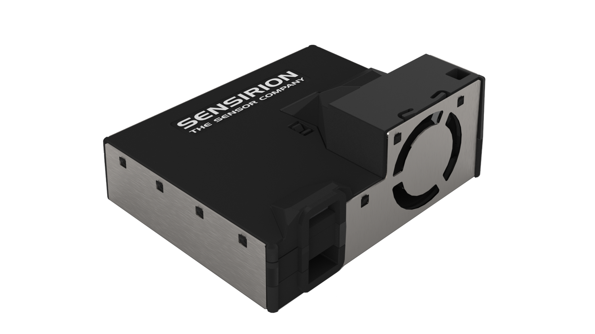
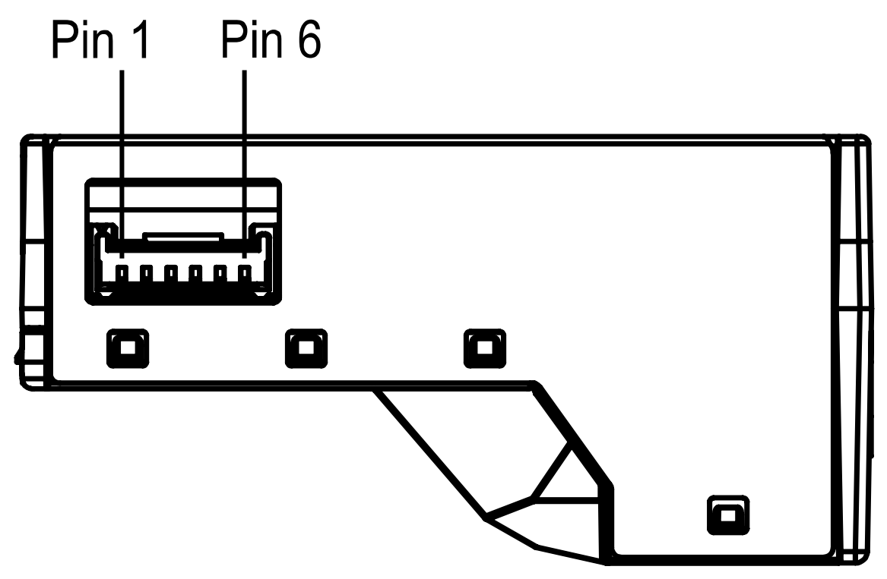

# Sensirion Raspberry Pi UART SEN44 Driver

This document explains how to set up the SEN44 sensor module to run on a Raspberry Pi using the provided code.

<center></center>

## Setup Guide

### Connecting the Sensor

Plug the provided USB cable into your Raspberry Pi.

If you don't have a suitable cable at hand, please find the SEN44 pinout listed below:

<center></center>

| *Pin* | *Name* | *Description* | *Comments* |
|-------|--------|---------------|------------|
| 1     | VDD    | Supply Voltage | 5V ±10%
| 2     | GND    | Ground |
| 3     | RX     | UART: Receiving pin for communication | TTL 5V and LVTTL 3.3V compatible
|       | SDA    | I2C: Serial data input / output | TTL 5V and LVTTL 3.3V compatible
| 4     | TX     | UART: Transmission pin for communication | TTL 5V and LVTTL 3.3V compatible
|       | SCL    | I2C: Serial clock input | TTL 5V and LVTTL 3.3V compatible
| 5     | SEL    | Interface select | Leave floating or pull to VDD to select UART
|       |        |  | Pull to GND to select I2C
| 6     | NC     | Do not connect |

### Raspberry Pi

- [Install the Raspberry Pi OS on to your Raspberry Pi](https://projects.raspberrypi.org/en/projects/raspberry-pi-setting-up)
- Download the driver from the [Sensirion GitHub Page](https://github.com/Sensirion/raspberry-pi-uart-sen44/tags)
  and extract the `.zip` on your Raspberry Pi
- Compile the driver
    1. Open a [terminal](https://www.raspberrypi.org/documentation/usage/terminal/)
    2. Navigate to the driver directory. E.g. `cd ~/raspberry-pi-uart-sen44`
    3. Run the `make` command to compile the driver

       Output:
       ```
       rm -f sen44_uart_example_usage
       cc -Os -Wall -fstrict-aliasing -Wstrict-aliasing=1 -Wsign-conversion -fPIC -I. -o sen44_uart_example_usage sen44_uart.h sen44_uart.c sensirion_uart_hal.h sensirion_shdlc.h sensirion_shdlc.c \
        sensirion_uart_hal.c sensirion_config.h sensirion_common.h sensirion_common.c sen44_uart_example_usage.c
       ```

- Test your connected sensor
    - Run `./sen44_uart_example_usage` in the same directory you used to compile the driver.

      Output:
      ```
      Serial number: C081C2651224B6FE
      Firmware: 0.4, Hardware: 6.0, protocol: 2.0
      Mass concentration pm1p0: 1
      Mass concentration pm2p5: 5
      Mass concentration pm4p0: 9
      Mass concentration pm10p0: 11
      Voc index: 0.0
      Ambient humidity: 40.81%RH
      Ambient temperature: 24.58°C
      Mass concentration pm1p0: 1
      Mass concentration pm2p5: 3
      Mass concentration pm4p0: 4
      Mass concentration pm10p0: 4
      Voc index: 0.0
      Ambient humidity: 40.81%RH
      Ambient temperature: 24.58°C
      ...
      ```
    
